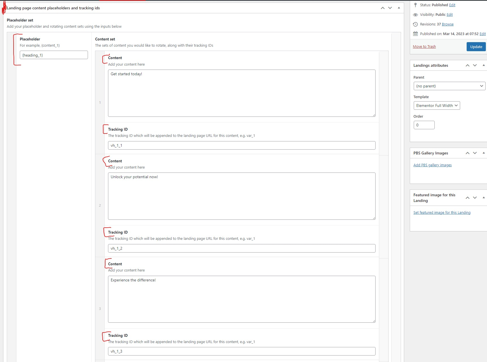
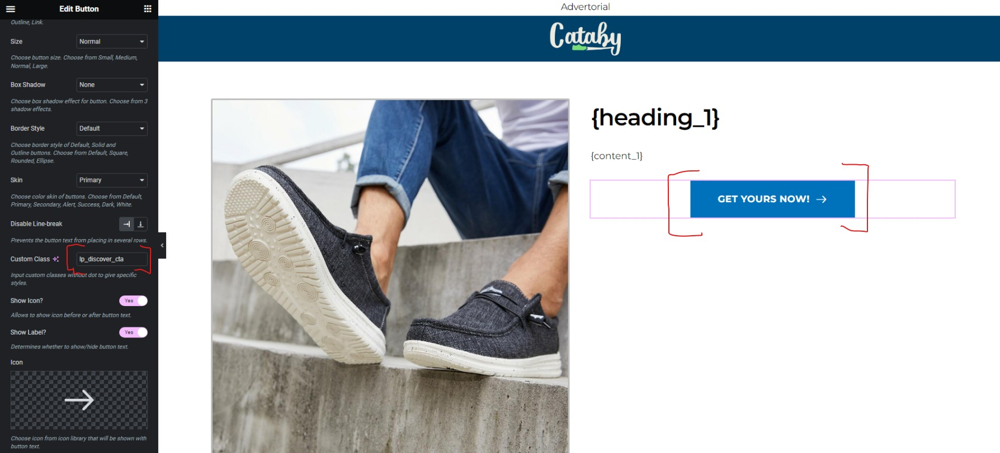

## SBWC Landing Page Multi Content Tracker

### Prerequisites
- ACF (Advanced Custom Fields) __must__ be installed for this plugin to work
- SBWC Custom Pages plugin __must__ be installed, or a custom post type "landings" must be registered for this plugin to work

### Overview
- This plugin adds the ability to add rotating content (headings and paragraph content) via the WP admin area to Landings post type
- Content is randomized and displayed on the front-end via the use of placeholders
- A particular front-end visitor will be shown the same content on a particular landing page if said visitor returns to said landing page within 24 hours
- After the 24 hour visitor cookie has expired, a new set of content will be displayed for said user using the same rule as previously mentioned
- Custom tracking links containing content placeholders for a particular landing is inserted on the page for all href attributes, allowing detailed content effectivity tracking
- A sample tracking link would be https://yourwebsite.com/en/product/abner-ash/?ct_ids=vh_1_7+cont_1_1+hd_2_2+cont_2_3+hd_3_2+cnt_abc_4+hdng_43_5+cnt_57_c

### Instructions
- After activating the plugin, navigate to an existing Landing post type, or create a new Landing via the Landing menu item in the WordPress Admin area
- On the Landing post type edit screen, you will find a metabox named __Landing page convent placeholders and tracking ids__
- In this metabox you will find inputs where you can define {placeholders}
- Each {placeholder} can have multiple content sets added, along with the associated tracking_id
- For example, let's say you've got a {heading_top} placeholder, you can define as many content/tracking sets for {heading_top} as you need; these will be rotated on a per user and page load basis
- A typical stucture would be
  - __{heading_top}__ => placeholder
    - __Get started today!__ => placeholder content
    - __vh_1_1__ => tracking id
    - __Unlock your potential now!__ => placeholder content
    - __vh_1_2__ => tracking id
    - __Join our community today!__ => placeholder content
    - __vh_1_3__ => tracking id
- In this way, you can add multiple {placeholders} to your page, each with multiple content sets and tracking ids
- __Please be mindful of the following:__
  - Placeholders __must__ make use of curly braces ({})
  - Tracking IDs must __only__ contain underscores (_), letters (a to z, upper or lowercase) and numbers (1 thru 0). No special characters allowed!
  - The content of your post, whether added via the standard content editing area, or via a page builder such as Elementor, __must__ contain all your {placeholders}; if you do not add said placeholders, your content will not be replaced and/or rotated!
  - All links on your landing page __must__ have the CSS class _lp_discover_cta_ if you want to replace the link you define with one which contains your content tracking ids

### Sample landing page edit screen
Please see below screenshots for reference pertaining to the instructions above.

Landing page/post edit screen:

Placeholders in editor:

Button with CSS class lp_discover_cta:

